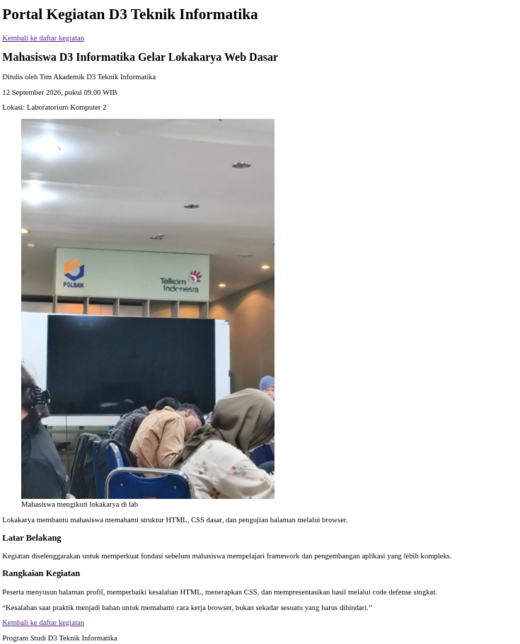
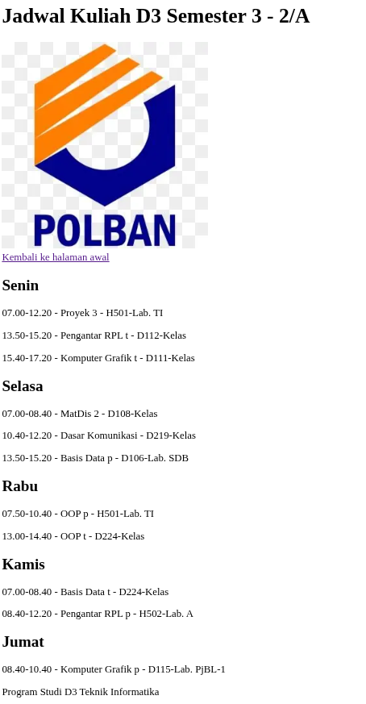
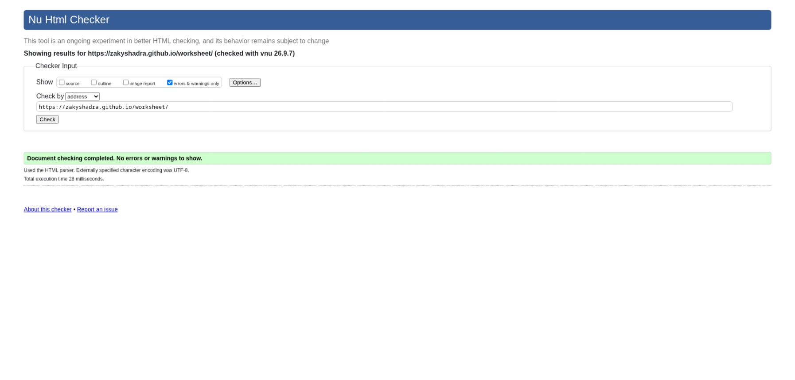

# Independent Challenge

## Artikel Kegiatan Kampus

manyusun halaman artikel berdasarkan data mentah berikut.
-  Nama situs: Portal Kegiatan D3 Teknik Informatika
-  Judul artikel: Mahasiswa D3 Informatika Gelar Lokakarya Web Dasar
-  Penulis: Tim Akademik D3 Teknik Informatika
-  Waktu publikasi: 12 September 2026, pukul 09.00 WIB
-  Lokasi: Laboratorium Komputer 2
-  Ringkasan: Lokakarya membantu mahasiswa memahami struktur HTML, CSS dasar, dan pengujian halaman melalui browser.
-  Isi bagian 1 - Latar Belakang: Kegiatan diselenggarakan untuk memperkuat fondasi sebelum mahasiswa mempelajari framework dan pengembangan aplikasi yang lebih kompleks.
-  Isi bagian 2 - Rangkaian Kegiatan: Peserta menyusun halaman profil, memperbaiki kesalahan HTML, menerapkan CSS, dan mempresentasikan hasil melalui code defense singkat.
-  Kutipan: “Kesalahan saat praktik menjadi bahan untuk memahami cara kerja browser, bukan sekadar sesuatu yang harus dihindari.”
-  Teks tautan kembali: Kembali ke daftar kegiatan
-  Nama gambar: assets/lokakarya-web.jpg
-  Deskripsi gambar: Mahasiswa berdiskusi di depan komputer saat lokakarya web

Tugas: Membuat artikel.html tanpa menyalin struktur dari contoh lain. Halaman wajib memiliki header, nav, main, article, minimal dua section, satu figure beserta figcaption, metadata time, kutipan, tautan kembali, dan footer.

## Screenshoot hasil dari web artikel ini

**hasil validator**

**alasan memakai section, article dan time**
- section: untuk membagi isi artikel menjadi beberapa bagian yang punya topik berbeda.
- article: karena isi halaman berupa satu konten yang bisa berdiri sendiri sebagai sebuah artikel.
- time: untuk menandai tanggal dan waktu kegiatan agar bisa dibaca browser sebagai informasi waktu.